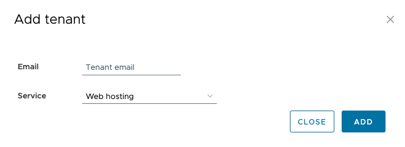
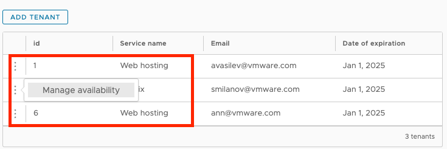

# Mothly report (Angular + Clarity + FastApi)

Client: http://localhost:4200

Server: http://localhost:8000

Swagger: http://localhost:8000/docs

Covered functionallity:
* Register/login customer (oauth2 with jwt and bearer).
* Create customer tenant/manage tenant availability level/create report.

## How to build?

1. Install `uv` package manager:

On macOS and Linux `curl -LsSf https://astral.sh/uv/install.sh | sh`.

2. Build server

Go to project dir `cd monthly-report`, install dependencies `uv sync` and start
the watcher with `uv run fastapi dev server/main.py`.

3. Build client

Go to client dir `cd monthly-report/client`, install dependencies `npm install`
and start the watcher with `npx ng serve`.

## Server architecture

Mix between ORM and raw sql queries.

`model.py` - Where you put DTO class definitions.

`schema.py` - Define ORM classes.

`repository.py` - Encapsulates database operations into a class, related to an entity
(crud operations).

`dependency.py` - Define FastApi dependencies to decouple app components, usually expose
repository, service or variables(e.g. settings) as dependencies.

`controller.py` - Define all endpoints for a router inside a controller. The controller
avoids duplication, e.g. we don't want to have in all endpoint functions parameter - session (database session). Controllers are part from the fastapi-utils module.

## Server config

All configurations reside in `server/.env` file.

